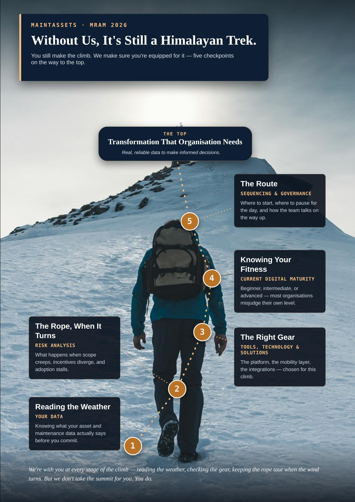

MAINTASSETS — Corporate Landing Page
A professional, responsive single-page landing website for MAINTASSETS, presented as a Client-Side Independent Consultant focused on asset management, maintenance transformation, technology decisions, implementation, adoption, and long-term business value.
The website was designed for a professional exhibition/consulting presentation and uses the supplied MAINTASSETS branding and original poster artwork as the primary visual content.
1. Project Overview
The MAINTASSETS landing page provides a polished digital presentation of the organisation, its consulting perspective, enterprise journey, industry experience, key questions, and contact information.
The page follows a storytelling structure rather than a conventional corporate template:
1. Hero / Introduction
2. About MAINTASSETS
3. Enterprise Journey / Approach
4. Warning Signs
5. Industries
6. The Questions
7. Experience
8. Talk to Us
9. Operation Addresses
10. Footer
The website is intentionally lightweight and can be hosted as a static website without a backend, database, or server-side application.
2. Website Purpose
The landing page is intended to:
- Present MAINTASSETS professionally to visitors and potential clients.
- Communicate the company's independent client-side consulting perspective.
- Explain the enterprise asset-management transformation journey.
- Highlight implementation, adoption, migration, and independent oversight considerations.
- Present industry experience through the supplied visual material.
- Encourage visitors to start a conversation with MAINTASSETS.
- Provide UAE and India operation addresses.
- Work effectively on desktop, tablet, and mobile devices.
3. Technology Stack
The website uses a simple static-web architecture.
Frontend
- HTML5
- CSS3
- Vanilla JavaScript
Fonts
The page uses:
- Inter
- Playfair Display
- Georgia fallback
- Arial / system sans-serif fallbacks
Google Fonts are imported directly in the HTML.
JavaScript
Only a small amount of vanilla JavaScript is used.
The current script provides the top-of-page scroll progress indicator.
No frontend framework is required.
No backend is required.
No database is required.
No build system is required.
4. Project Structure
maintassets-website/
│
├── index.html
├── README.md
│
└── assets/
    ├── maintassets-original-logo.png
    ├── poster-1.jpg
    ├── poster-2.jpg
    ├── poster-3.jpg
    ├── poster-4.jpg
    ├── poster-5.jpg
    ├── poster-6.jpg
    ├── poster-7.jpg
    ├── poster-8.jpg
    └── poster-9.jpg
index.html
The main webpage containing:
- Page structure
- Navigation
- All section content
- CSS styling
- Responsive media queries
- Small JavaScript interaction
assets/
Contains the original MAINTASSETS logo and poster artwork used throughout the website.
The HTML references these assets using relative paths such as:

Therefore, the assets folder must remain alongside index.html.
5. Page Sections
5.1 Hero Section
The opening section introduces MAINTASSETS with the positioning:
CLIENT-SIDE INDEPENDENT CONSULTANT

The main message focuses on making the right decisions for assets.
The hero contains:
- MAINTASSETS logo
- Main headline
- Introductory description
- "Explore the journey" button
- "Talk to us" button
- Asset-management capability keywords
The hero navigation is fixed at the top of the page.
5.2 About MAINTASSETS
The About section explains the independent client-side perspective.
It communicates four key ideas:
- Understand the current state before changing it.
- Choose technology and solutions around the business need.
- Challenge assumptions, risks, and implementation decisions.
- Keep adoption and long-term value visible.
Poster 1 is displayed alongside the content.
5.3 The Enterprise Journey / Our Approach
The approach section presents three transformation moments.
01 — Implementation & Adoption
Why go-lives fade
Uses Poster 2.
02 — Migration
Move with intent
Uses Poster 3.
03 — Independent Oversight
Know who's watching
Uses Poster 4.
The poster cards have an interactive hover effect on desktop.
When a visitor hovers over a card:
- The card lifts slightly.
- The card becomes larger.
- The poster viewing area expands.
- The poster image zooms.
- A "HOVER TO READ" indicator appears.
On smaller screens, the cards automatically switch to a mobile-friendly layout without relying on hover interactions.
5.4 Warning Signs
Heading:
Spot the signs before they become setbacks.

This section explains that transformation issues can appear in:
- Data
- Processes
- Field operations
- Decisions
Poster 5 is displayed as the primary visual.
5.5 Industries
The Industries section introduces the cross-industry perspective of MAINTASSETS.
The section communicates that different industries have different assets and operating environments, while still sharing common needs around:
- Maintenance transformation
- Asset data
- Technology
- Adoption
- Clarity in decision-making
Poster 6 is used as the primary industry visual.
5.6 The Questions
This is a major visual section of the landing page.
Heading:
Ask the questions that matter.

The section highlights four interconnected themes:
- Strategy
- Assets
- Data
- People
A visual "RIGHT QUESTIONS" centre element connects these themes.
Poster 7 is displayed as the centrepiece of this section.
Poster 7 is intentionally kept as a prominent visual element rather than being compressed into a small card.
5.7 Experience
Heading:
Real engagements. Real names.

This section presents MAINTASSETS' cross-industry experience and consulting perspective.
Poster 8 is used as the main experience visual.
5.8 Talk to Us
The final engagement section encourages visitors to continue the conversation beyond the exhibition.
The section includes:
- Consulting-oriented introduction
- Email contact button
- Link back to the Questions section
- Poster 9
The email button currently uses:
manojkumar@maintassets.com
The button uses a standard mailto: link, so clicking it opens the visitor's configured email application.
5.9 Operation Addresses
A compact address section appears immediately above the footer.
UAE
Sharjah Media City
Al Messaned, Al Mtsannid Suburb
Sharjah, United Arab Emirates
India
Rus Coworks
18th Avenue, Pudur, Ambattur
Chennai, India
The addresses are deliberately styled as supporting information rather than as a large highlighted section.
On mobile devices, the two-column layout automatically changes to a single-column layout.
5.10 Footer
The footer contains:
Copyright © 2026 MAINTASSETS. All rights reserved.
and:
Terms & Privacy
6. Navigation
The fixed navigation contains:
- About
- Our Approach
- Industries
- Questions
- Experience
- Talk to Us
Each navigation item uses an internal anchor link.
Examples:
<a href="#about">About</a>
<a href="#approach">Our Approach</a>
<a href="#industries">Industries</a>
<a href="#questions">Questions</a>
<a href="#experience">Experience</a>
<a href="#talk">Talk to Us</a>
The page uses smooth scrolling for section navigation.
7. Responsive Design
The website is responsive and supports:
- Desktop
- Laptop
- Tablet
- Mobile
Responsive behaviour is controlled using CSS media queries.
Desktop
The layout uses multi-column grids for:
- Hero
- About
- Approach cards
- Warning Signs
- Questions
- Experience
- Talk to Us
- Operation Addresses
Tablet
Major two-column sections collapse where necessary to provide more usable space.
Mobile
The site automatically:
- Reduces navigation/logo dimensions.
- Changes multi-column layouts to single-column layouts.
- Removes desktop-only hover enlargement behaviour.
- Adjusts poster sizing.
- Reduces section spacing.
- Converts operation addresses into a single column.
- Keeps buttons and content usable on smaller screens.
8. Visual Design System
The page uses a professional consulting-oriented visual system.
Primary colours
The design is based around:
- Deep navy
- Professional blue
- Light neutral backgrounds
- White content surfaces
- Gold accent
- Slate/grey supporting text
The primary CSS variables are defined near the beginning of the stylesheet:
:root{
    --n:#091f3a;
    --b:#1769d2;
    --g:#efb45f;
    --p:#f5f8fb;
    --m:#64748b;
    --l:#dce5ee;
    --t:#112a47;
}
Typography
Large headings use a serif display font for visual distinction, while body text and navigation use a clean sans-serif font.
This creates a combination of:
- Professional
- Editorial
- Consulting
- Modern corporate
visual characteristics.
9. Poster and Brand Asset Handling
The supplied MAINTASSETS logo is used directly:
assets/maintassets-original-logo.png
The website does not recreate or redraw the logo using HTML or CSS.
The supplied poster artwork is also used directly as image assets.
Poster mapping:
Asset	Website Usage
poster-1.jpg	About / MAINTASSETS journey
poster-2.jpg	Implementation & Adoption
poster-3.jpg	Migration
poster-4.jpg	Independent Oversight
poster-5.jpg	Warning Signs
poster-6.jpg	Industries
poster-7.jpg	The Questions centrepiece
poster-8.jpg	Experience
poster-9.jpg	Talk to Us

The poster artwork is therefore separated from the HTML content and can be replaced independently as long as the filename and path remain unchanged.
10. Local Development
Because this is a static website, it can be opened directly in a browser.
Option 1 — Open directly
Double-click:
index.html
Option 2 — VS Code Live Server
Open the project in VS Code and use the Live Server extension.
Option 3 — Python local server
From the project folder:
python -m http.server 8000
Then open:
http://localhost:8000
No installation of Node.js, React, Express, MongoDB, or any other backend technology is required.
11. GitHub Pages Deployment
The website is suitable for GitHub Pages because it is a static HTML/CSS/JavaScript website.
Recommended repository structure:
main
│
├── index.html
├── README.md
└── assets/
GitHub Pages configuration
Use:
Settings
→ Pages
→ Build and deployment
→ Deploy from a branch
→ Branch: main
→ Folder: /(root)
After committing changes to the main branch, GitHub Pages automatically rebuilds the website.
12. Custom Domain
The production website is configured for:
www.maintassets.com
The custom domain is managed through GitHub Pages with DNS configuration at the domain provider.
HTTPS is enabled through GitHub Pages.
Important
For normal website content changes, there is no need to modify:
- DNS
- Custom-domain configuration
- HTTPS
- SSL/TLS settings
Only commit the website changes to the main branch.
13. Updating Website Content
Most content can be changed directly in:
index.html
Examples:
- Headings
- Paragraphs
- Navigation labels
- Email address
- Operation addresses
- Button text
- Section text
After editing:
1. Save the changes.
2. Commit the changes to main.
3. GitHub Pages automatically rebuilds the site.
4. Refresh the website after deployment.
A hard refresh can be used if the browser is displaying an older cached version:
Ctrl + F5
14. Replacing Posters or Logo
To replace an image:
1. Open the assets folder.
2. Upload the replacement image.
3. Keep the expected filename, or update the corresponding  reference in index.html.
4. Commit the change.
For example:

If poster-7.jpg is replaced with another image using the same filename, no HTML modification is necessary.
15. Important Maintenance Rules
Keep the folder structure intact
Do not move the assets folder away from index.html.
Correct:
index.html
assets/
    poster-1.jpg
Incorrect:
index.html
images/
    assets/
        poster-1.jpg
unless the HTML paths are updated accordingly.
Do not remove the original logo
The navigation and hero section depend on:
assets/maintassets-original-logo.png
Do not rename poster files without updating HTML
The page expects the existing poster filenames.
Preserve responsive CSS
Changes to grid layouts and media queries should be tested on mobile as well as desktop.
Test email links
The Talk to Us email button should continue to use a valid mailto: address.
16. Performance Characteristics
The site is intentionally lightweight because it is a static landing page.
Performance benefits include:
- No backend requests
- No database
- No framework runtime
- Minimal JavaScript
- Static image assets
- CSS-based animations
- Browser-native anchor navigation
- GitHub Pages static hosting
The largest page resources are expected to be the poster images and logo assets.
For future performance optimisation, image compression and modern image formats such as WebP can be considered, provided visual quality remains acceptable.
17. Accessibility Considerations
The page includes several basic accessibility practices:
- Semantic section structure
- Descriptive image alt text where appropriate
- Standard anchor links
- Readable colour contrast in major sections
- Responsive layouts
- Buttons with clear actions
Further accessibility improvements can be added in future versions, including:
- More comprehensive alt descriptions for every poster
- Keyboard-focused navigation states
- ARIA labels for navigation controls
- Improved mobile menu semantics
18. Browser Compatibility
The website is intended for modern browsers, including:
- Google Chrome
- Microsoft Edge
- Mozilla Firefox
- Safari
The layout uses modern CSS features such as:
- CSS Grid
- Flexbox
- clamp()
- CSS gradients
- backdrop-filter
- CSS transitions
- Responsive media queries
Very old browsers may not provide the full visual experience.
19. Contact
The primary website contact is currently configured as:
manojkumar@maintassets.com
Website:
https://www.maintassets.com
20. Deployment Workflow
The normal content-update workflow is:
Edit index.html / assets
        ↓
Commit changes to main
        ↓
GitHub Pages builds the site
        ↓
Website updates
        ↓
Refresh https://www.maintassets.com
No manual server deployment is required.
21. Project Status
Status: Production-ready static landing page
Hosting: GitHub Pages
Custom domain: www.maintassets.com
HTTPS: Enabled
Architecture: Static HTML/CSS/JavaScript
Backend: None
Database: None
Build tool: None
Primary visual assets: MAINTASSETS original logo and supplied posters
22. Credits
Website design and implementation prepared for:
MAINTASSETS
Positioning:
Client-Side Independent Consultant
The website incorporates the supplied MAINTASSETS logo and poster artwork as the primary brand and presentation assets.
